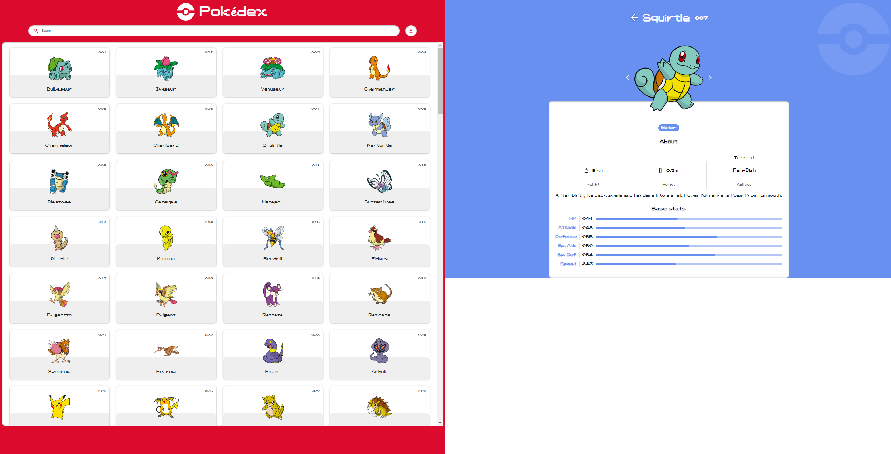

# Pokémon Pokedex

This short but sweet project is a web application that allows users to explore detailed information about the first 151 Pokémon, including their stats, abilities, types, and more. Built using HTML, CSS, and JavaScript, it leverages the PokeAPI to fetch real-time data about each Pokémon.

## Table of Contents
- [Features](#features)
- [Installation](#installation)
- [Usage](#usage)
- [Lessons Learned](#lessons-learned)
- [Future Improvements](#future-improvements)
- [Acknowledgements](#acknowledgements)

## Features

- **Search and Filter**: Search for Pokémon by name, number, or type. Filter options include sorting by number, name, type, or viewing all Pokémon.
- **Detailed Pokémon Information**: View detailed stats, abilities, and descriptions for each Pokémon.
- **Responsive Design**: The application is fully responsive, providing an optimal viewing experience across a wide range of devices.
- **Navigation**: Easily navigate between different Pokémon using arrow buttons.
- **Favorites**: Mark Pokémon as favorites and store them locally.

## Installation

To get a local copy up and running follow these simple steps:

1. **Clone the repository:**
   \`\`\`bash
   git clone https://github.com/Imti-Al/pokemon-pokedex.git
   \`\`\`

2. **Open the project directory:**
   \`\`\`bash
   cd pokemon-pokedex
   \`\`\`

3. **Open \`index.html\` in your preferred browser:**
   \`\`\`bash
   open index.html
   \`\`\`

## Usage

- **Search**: Use the search bar to find Pokémon by name, number, or type.
- **Sort**: Use the sort options to filter Pokémon by number, name, type, or view all Pokémon.
- **Navigate**: Click on a Pokémon to view its detailed information, and use the navigation arrows to move between Pokémon.
- **Favorites**: Click the "Add to Favorites" button to mark a Pokémon as a favorite. The list of favorite Pokémon is stored locally in your browser.

## Lessons Learned

During the development of this project, I have learned:

- **API Integration**: How to fetch and manipulate data from a public API (PokeAPI) and display it dynamically on a web page.
- **Responsive Design**: Techniques to make a web application responsive and user-friendly across various devices.
- **JavaScript ES6 Features**: Utilized modern JavaScript features such as async/await, destructuring, and template literals.
- **Error Handling**: Implemented error handling to manage API fetch errors and improve the user experience.

## Future Improvements

In future revisions, I plan to add the following features:

1. **Search by Generation**: Filter Pokémon by their generation (e.g., Generation I, II, III).
2. **Pagination**: Implement pagination to manage a large number of Pokémon efficiently.
3. **Detailed Type Information**: Show more details about each type, including strengths, weaknesses, and examples.
4. **Evolution Chains**: Display the evolution chain of each Pokémon with conditions for evolution.
5. **Sorting Options**: Add more sorting options like weight, height, or base stats.
6. **Animations and Transitions**: Enhance visual appeal with CSS animations and transitions.
7. **Comparison Feature**: Allow users to compare two or more Pokémon side-by-side.
8. **Dark Mode**: Add a dark mode for a better user experience in low-light environments.
9. **Ability Descriptions**: Include descriptions for each ability displayed.
10. **Language Support**: Provide support for multiple languages.

## Acknowledgements

- [PokeAPI](https://pokeapi.co/) for providing the Pokémon data.
- [Figma](https://www.figma.com/community/file/979132880663340794/pokedex) for the design inspiration.
- The Pokémon Company for the inspiration and data.

---

